  

# eddinos2

I build security tools and publish small, evidence-heavy research repos.

Most of my public work sits around reverse engineering, vulnerability root cause analysis,
exploitability boundaries, and the tooling that makes that work repeatable. The nearby
edge cases are systems automation, full-stack prototypes, and AI-assisted workflows where
the model is a component, not the product.

I care about proof tiers more than theatrics: crash, reachability, primitive, RCE, and
unknowns should stay separate.

## Main Thread

- Binary analysis and decompilation: loaders, IR, CFG/SSA, patch previews, annotation formats.
- Patch-diff root cause analysis: CVE intake, advisory correlation, before/after binary comparison, report generation.
- Apple and browser attack surfaces: ImageIO, IOKit user clients, filesystem parsers, V8 optimization bugs.
- Automation with audit trails: MCP, LangGraph, Ghidra/IDA backends, reproducible fixtures, explicit confidence tiers.

## Selected Work

| Project | What it does | Interesting part | State |
|---|---|---|---|
| [Aletheia](https://github.com/eddinos2/aletheia) | Clean-room Rust toolkit for binary loading, disassembly, decompilation, patch diffing, and MCP-driven reverse-engineering workflows. | Library-first design, deterministic parallel analysis, git-friendly annotations, and shared CLI/MCP/GUI protocol surfaces. | Active research build. |
| [Peekaboo](https://github.com/eddinos2/Peekaboo) | CVE patch-diff root-cause analyzer for iOS, Linux, and Windows workflows. | Apple advisory/IPSW pipeline, Ghidra/IDA backends, LLM routing, confidence scoring, and exportable reports. | Alpha; built for repeatable analysis, not automatic truth. |
| [CVE-2026-64747](https://github.com/eddinos2/CVE-2026-64747) | AppleAVE2 kernel driver wire-format research and macOS reachability PoC. | Reversed IOKit user-client protocol, selector contracts, validation path, and overflow math. | Reachability tier; not claimed as RCE. |
| [CVE-2026-78938](https://github.com/eddinos2/CVE-2026-78938) | V8 TurboFan type-confusion root cause and exploit notes. | Turns the bug into addrof/fakeobj and arbitrary R/W over the compressed heap with runtime discovery. | Research PoC inside the V8 sandbox. |
| [CVE-2026-28956 JXL surface](https://github.com/eddinos2/CVE-2026-28956-jxl-messages-surface) | iOS Messages JPEG XL preview-path delivery-surface probe. | Separates delivery reachability from exploit reliability and documents the patch-diff attribution. | Surface finding; reliability not overstated. |
| [SnapChasse](https://github.com/eddinos2/snapchasse) | Full-stack geolocation game with auth, maps, role-aware flows, and Supabase/Postgres backing. | Shows the non-security side: product flow, RLS-aware data modeling, location validation, and TypeScript UI work. | Prototype. |

## Secondary Edges

- Full-stack TypeScript: Next.js, Vite, React, Supabase, Postgres, serverless functions, webhook-style APIs.
- Security-aware product plumbing: auth flows, RLS policies, rate limits, validation boundaries, audit logs.
- Agentic tooling: MCP interfaces, LangGraph pipelines, LLM-backed analysis where outputs remain inspectable.

## Tools I Reach For

Rust, Python, C, Objective-C, JavaScript/TypeScript, SQL/Postgres, Ghidra, IDA,
IOKit, ImageIO/CoreGraphics, Supabase, Next.js, Vite, LangGraph, MCP.

## Current Questions

- How far can clean-room RE tooling go without hiding uncertainty behind confident output?
- What does useful AI assistance look like when the artifact still needs to survive expert review?
- Which parser, media, kernel, and browser surfaces look boring until delivery context changes them?

## Contact

Open an issue on the relevant repository. For sensitive reports, use the repo's
`SECURITY.md` when present.
